# ParkSpace MSU (ระบบจองและจัดการพื้นที่จอดรถอัจฉริยะ มหาวิทยาลัยมหาสารคาม)

> **"จองง่าย จอดสะดวก · Easy to Book, Easy to Park"**  
> เว็บแอปพลิเคชันและ PWA ระบบบริหารจัดการและจองพื้นที่จอดรถอัจฉริยะ รองรับ 2 ภาษา (ไทย/อังกฤษ) สำหรับนิสิต อาจารย์ บุคลากร เจ้าหน้าที่รักษาความปลอดภัย และผู้บริหาร มหาวิทยาลัยมหาสารคาม

🌐 **เว็บไซต์ใช้งานจริง (Production URL):** [https://parkspace-msu.vercel.app/th](https://parkspace-msu.vercel.app/th)  
📦 **GitHub Repository:** [https://github.com/bestcynix/ParkSpace-MSU](https://github.com/bestcynix/ParkSpace-MSU) *(Public Repository)*

---

## 📌 สารบัญ (Table of Contents)
1. [ความเป็นมาและวัตถุประสงค์ (Project Background & Objectives)](#-ความเป็นมาและวัตถุประสงค์)
2. [ระบบและฟังก์ชันการทำงานทั้งหมด (System Features & Modules)](#-ระบบและฟังก์ชันการทำงานทั้งหมด)
3. [สถาปัตยกรรมและเทคโนโลยีที่ใช้ (Tech Stack)](#-สถาปัตยกรรมและเทคโนโลยีที่ใช้)
4. [โครงสร้างโค้ดสำหรับนักพัฒนา (Developer Code Map)](#-โครงสร้างโค้ดสำหรับนักพัฒนา)
5. [ประวัติการปรับปรุงและแก้บั๊กสำคัญล่าสุด (Recent Updates & Changelog)](#-ประวัติการปรับปรุงและแก้บั๊กสำคัญล่าสุด)
6. [การติดตั้งและรันบนเครื่อง Local (Local Development Setup)](#-การติดตั้งและรันบนเครื่อง-local)
7. [ขั้นตอนการ Deploy ระบบ (Deployment Guide)](#-ขั้นตอนการ-deploy-ระบบ)
8. [การสร้างแอพมือถือ (Mobile App Packaging via Capacitor)](#-การสร้างแอพมือถือ-capacitor)
9. [ความปลอดภัยและนโยบายข้อมูล (Security & Data Policies)](#-ความปลอดภัยและนโยบายข้อมูล)

---

## 🎯 ความเป็นมาและวัตถุประสงค์

### ปัญหาที่พบ (Pain Points)
- **ปัญหาการวนหาที่จอดรถ**: ในช่วงเวลาเร่งด่วน การเรียนการสอน และกิจกรรมสำคัญ พื้นที่จอดรถบริเวณคณะและอาคารส่วนกลางของ มมส. มักเต็ม ทำให้ผู้ใช้เสียเวลาและเกิดการจราจรติดขัดสะสม
- **ขาดการรับรู้ข้อมูลแบบ Real-time**: ผู้ขับขี่ไม่ทราบล่วงหน้าว่าลานจอดรถเป้าหมายมีช่องว่างหรือไม่ ทำให้ต้องขับวนค้นหา
- **การจัดการของเจ้าหน้าที่ยังเป็นแบบแมนนวล**: การตรวจตราบัตรจอดรถและการบันทึกสถิติยังขาดระบบดิจิทัลเชื่อมโยง

### วัตถุประสงค์การพัฒนา (Objectives)
1. **อำนวยความสะดวกแก่ผู้ขับขี่**: ให้นิสิต บุคลากร และผู้มาติดต่อ สามารถตรวจสอบสถานะที่ว่างแบบเรียลไทม์ และจองช่องจอดรถล่วงหน้าได้อย่างสะดวกรวดเร็ว
2. **ยกระดับความปลอดภัยด้วยระบบดิจิทัล (Smart Security)**: มีบัตรผ่านดิจิทัล (Digital QR Pass) ให้เจ้าหน้าที่รักษาความปลอดภัย (รปภ.) ใช้มือถือสแกนตรวจสอบการเข้า-ออกได้ทันที
3. **บริหารจัดการข้อมูลแบบรวมศูนย์ (Centralized Operations)**: มีระบบแดชบอร์ดสำหรับผู้ดูแลระบบ เพื่อดูความหนาแน่น วางแผนจัดการพื้นที่ และวิเคราะห์ข้อมูลการใช้งานจริงของมหาวิทยาลัย

---

## 🚀 ระบบและฟังก์ชันการทำงานทั้งหมด

ระบบถูกออกแบบโดยแบ่งตามกลุ่มผู้ใช้งาน 3 บทบาทหลัก พร้อมระบบสนับสนุน:

```mermaid
graph TD
    User["👤 ผู้ใช้งานทั่วไป (นิสิต/บุคลากร/ผู้มาติดต่อ)"]
    Staff["👮 เจ้าหน้าที่รักษาความปลอดภัย (Staff)"]
    Admin["⚙️ ผู้ดูแลระบบ (Admin / Developer)"]

    User --> U1["ค้นหาลานจอด 28 จุด + แผนที่ GPS"]
    User --> U2["จองช่องจอดแยกแถว A-G / 100 ช่อง"]
    User --> U3["บัตรผ่าน QR Pass + แจ้งเตือน"]
    User --> U4["จัดการยานพาหนะส่วนตัว"]

    Staff --> S1["สแกน QR Code ตรวจรถเข้า-ออก"]
    Staff --> S2["ค้นหาทะเบียนรถด่วน (Debounced)"]
    Staff --> S3["บันทึกและจัดการเหตุการณ์ผิดปกติ"]

    Admin --> A1["Live Operations Dashboard"]
    Admin --> A2["จัดการข้อมูลลานจอด & ผังช่องจอด"]
    Admin --> A3["จัดการผู้ใช้ สิทธิ์ และ Audit Logs"]
    Admin --> A4["ส่งออกรายงานสถิติเป็น CSV"]
```



### 1. ระบบสำหรับผู้ใช้งานทั่วไป (General User & Booking)
- **รองรับ 2 ภาษาเต็มรูปแบบ (Bilingual TH / EN)**: สลับภาษาได้ทันทีผ่านเส้นทาง URL (`/th/*` และ `/en/*`)
- **ทำเนียบลานจอดรถทางการ 28 จุด**: อ้างอิงตามประกาศ มมส. แสดงความจุ สถานะเปิด-ปิด และอัตราความหนาแน่น
- **แผนที่อัจฉริยะ (Interactive Campus Map)**:
  - ระบุตำแหน่งพิกัด GPS ผู้ใช้สด (Haversine Distance)
  - กรองเฉพาะลานที่มีที่ว่าง (Available Only)
  - ปุ่มเปิดนำทางตรงสู่ **Google Maps** และ **Apple Maps** (ตรวจจับ iOS อัตโนมัติ)
- **ระบบเลือกและจองช่องจอด (Smart Slot Booking)**:
  - ผังช่องจอดละเอียดแยกแถว A–G รวม 100 ช่องต่อลาน
  - ระบุวัน เวลาเริ่มต้น-สิ้นสุด และประเภทรถ
  - **ระบบป้องกันเวลาผิดพลาด**: บล็อกการเลือกวันที่ย้อนหลัง และบล็อกช่วงเวลาที่เลยมาแล้วในวันปัจจุบัน
  - **ตัวช่วยจัดรูปแบบทะเบียนรถไทยอัตโนมัติ**: จัดช่องว่างและตัวอักษรให้อัตโนมัติ
  - **ตัวตรวจสอบประเภทรถและช่องจอด**: แจ้งเตือนหากประเภทรถไม่ตรงกับข้อกำหนดของช่องจอด (เช่น รถเก๋งจองช่อง EV หรือมอเตอร์ไซค์)
- **บัตรผ่านดิจิทัล (Digital QR Pass)**:
  - สร้างรหัสอ้างอิงและ QR Code เฉพาะการจอง สำหรับใช้แสดงต่อเจ้าหน้าที่
- **ระบบยานพาหนะของฉัน (My Vehicles)**:
  - บันทึก แก้ไข ลบข้อมูลรถยนต์ รถมอเตอร์ไซค์ พร้อมดึงมาเลือกจองได้ในคลิกเดียว

### 2. ระบบสำหรับเจ้าหน้าที่รักษาความปลอดภัย (Staff Security Console)
- **สแกนเนอร์ QR Code ผ่านกล้อง (Camera Scanner)**:
  - ใช้กล้องมือถือสแกน QR Pass ของผู้ใช้เพื่อ Check-in รถเข้า และ Check-out รถออก
- **ค้นหาทะเบียนรถด่วน (Debounced Plate Search)**:
  - พิมพ์ค้นหาทะเบียนรถ มีระบบหน่วงเวลา 350ms ป้องกันการยิงคำขอซ้ำซ้อน
  - แสดงปุ่มชิปผลการค้นหาด่วน (Quick Match Chips) ตรวจสอบบัตรผ่านได้ทันที
- **ระบบรายงานเหตุการณ์ (Incident Reporting)**:
  - บันทึกการกระทำผิด เช่น จอดทับช่อง, กีดขวาง, จอดเกินเวลา พร้อมแนบรูปถ่ายและสถานะการแก้ไข

### 3. ระบบสำหรับผู้ดูแลระบบและนักพัฒนา (Admin & Developer Console)
- **Live Operations Dashboard**:
  - แสดงจำนวนที่ว่าง จองแล้ว กำลังใช้งาน และเหตุการณ์แบบ Real-time
  - ป้ายแจ้งเตือนความหนาแน่นวิกฤต (>90%)
  - **ส่งออกรายงาน CSV**: รองรับ UTF-8 BOM เปิดอ่านภาษาไทยใน Microsoft Excel ได้ถูกต้อง
- **จัดการข้อมูลลานจอดรถ (Parking Area Manager)**:
  - เพิ่ม/ลบ/แก้ไขข้อมูลลานจอด พิกัดละติจูด/ลองจิจูด
  - อัปโหลดรูปภาพปกและรูปภาพทางเข้า (รองรับครอบตัด Crop, ปรับขนาด, Base64 และ Supabase Storage)
  - กำหนดประเภทรถที่อนุญาตสำหรับแต่ละลาน
- **จัดการผังช่องจอดและแถว (Slot & Row Layout Manager)**:
  - จัดการแถว A-G และเพิ่ม/ปิดปรับปรุงช่องจอดแต่ละจุด
- **จัดการการจองและเหตุการณ์ (Bookings & Incidents Management)**
- **จัดการผู้ใช้และสิทธิ์ (User & Role Management)**:
  - กำหนดสิทธิ์ Admin, Staff, Student, Personnel
- **ประวัติการทำงานของระบบ (Audit Logs Panel & API)**:
  - ค้นหา กรอง และลบประวัติการทำงานในระบบ
- **เครื่องมือจัดการฐานข้อมูล (Database Explorer)**:
  - ตรวจสอบโครงสร้างตารางและรันคำสั่งตรวจสอบ
- **ระบบ Feature Flags & Admin Demo Sandbox**:
  - สลับโหมดพรีวิว Dark Mode, โหมดจำลองข้อมูล โดยไม่กระทบฐานข้อมูลจริง

### 4. ระบบคู่มือและนำเสนอ (Guide & Interactive Presentation)
- หน้า `/th/guide`: คู่มือแนะนำระบบและสไลด์นำเสนอโครงงานแบบ Interactive สำหรับกรรมการและผู้ตรวจประเมิน
- แผนผัง URL ระบบทั้งหมด (Full URL Sitemap Directory)

---

## 🛠️ สถาปัตยกรรมและเทคโนโลยีที่ใช้

| Layer | Technology | รายละเอียด |
| :--- | :--- | :--- |
| **Frontend Framework** | **Next.js 16 (Turbopack)** | App Router, React 19, Server & Client Components |
| **Language** | **TypeScript** | Type-safe ตลอดทั้งระบบ ผ่านการทดสอบ 0 errors |
| **Styling** | **Custom CSS + Tailwind** | CSS Design Tokens, Responsive Flex/Grid, Dark Mode Support |
| **Icons & Media** | **Lucide React** | ไอคอน SVG คมชัด โหลดเร็ว |
| **QR Code Engine** | **qrcode / html5-qrcode** | สร้าง QR Pass และสแกนผ่านกล้องเว็บแคม/มือถือ |
| **Database & Auth** | **Supabase (PostgreSQL)** | RLS Security, Auth Tokens, Realtime WebSockets, Storage |
| **Mobile Packaging** | **Capacitor 8** | แปลงเว็บแอปเป็น Android APK/AAB และ iOS App |
| **Cloud Deployment** | **Vercel** | Edge Network, Serverless Functions, Continuous Deployment |

---

## 📂 โครงสร้างโค้ดสำหรับนักพัฒนา (Developer Code Map)

```text
ParkSpace-MSU/
├── android/                   # โฟลเดอร์เนทีฟ Android สำหรับ Capacitor
├── ios/                       # โฟลเดอร์เนทีฟ iOS สำหรับ Capacitor
├── public/                    # ไฟล์สแตติก (โลโก้, ไอคอน PWA, รูปภาพประกอบ)
│   ├── brand/                 # โลโก้ ParkSpace MSU
│   └── ai/                    # ภาพประกอบ AI Onboarding ที่ระบุป้ายชัดเจน
├── scripts/                   # สคริปต์ทดสอบและบำรุงรักษา
│   └── e2e-smoke.mjs          # End-to-End smoke test runner
├── src/
│   ├── app/                   # Next.js App Router
│   │   ├── [locale]/          # เส้นทางตามภาษา (/th, /en)
│   │   │   ├── admin/         # แดชบอร์ดและเครื่องมือผู้ดูแลระบบ
│   │   │   ├── app/           # ระบบฝั่งผู้ใช้ (การจอง, บัตรผ่าน, โปรไฟล์, รถยนต์)
│   │   │   ├── parking/       # หน้ารายการลานจอด, แผนที่, ผังช่องจอด
│   │   │   ├── staff/         # คอนโซลเจ้าหน้าที่ รปภ. (สแกนเนอร์, เหตุการณ์)
│   │   │   └── guide/         # คู่มือและผังพรีเซนต์โครงงาน
│   │   ├── api/               # Serverless Backend API Routes
│   │   │   ├── admin/         # APIs ผู้ดูแลระบบ (Audit logs, DB, Users, Stats)
│   │   │   ├── auth/          # APIs พิเศษสำหรับการเข้าสู่ระบบ
│   │   │   ├── bookings/      # APIs การจองและออก QR Code
│   │   │   ├── parking/       # APIs คำนวณความจุลานจอดแบบ Real-time
│   │   │   └── staff/         # APIs สแกนบัตรผ่านและเปลี่ยนสถานะรถ
│   │   ├── globals.css        # ไฟล์สไตล์หลักและการจัดวาง Layout
│   │   └── layout.tsx         # Root Layout
│   ├── components/            # React Components แบ่งตามโมดูล
│   │   ├── admin/             # คอมโพเนนต์ผู้ดูแลระบบ (AreaManager, SlotLayout, ConsoleLiveData)
│   │   ├── booking/           # คอมโพเนนต์การจอง (BookingForm, BookingsList, QrPass)
│   │   ├── brand/             # โลโก้และแถบแบรนด์
│   │   ├── layout/            # Header, Footer, ThemeToggle, HeaderUserDropdown
│   │   ├── map/               # แผนที่ Campus Interactive Map
│   │   ├── parking/           # CapacitySummary, LiveAreaStatus, SlotGrid
│   │   ├── staff/             # StaffScanner, IncidentForm
│   │   └── ui/                # คอมโพเนนต์ส่วนกลาง (ImageInputWithUpload, CropperModal)
│   └── lib/                   # โมดูลฟังก์ชันและเครื่องมือช่วยเหลือ
│       ├── feature-flags.ts   # ระบบจัดการ Feature Toggles
│       ├── i18n.ts            # พจนานุกรมคำแปลภาษาไทย-อังกฤษ
│       ├── image-helpers.ts   # ตัวจัดการ Fallback และแปลง URL รูปภาพ
│       ├── vehicle-utils.ts   # ตัวตรวจสอบและจัดรูปแบบทะเบียนรถไทย
│       └── supabase/          # Supabase Browser & SSR Client
└── supabase/                  # ฐานข้อมูล Supabase
    ├── migrations/            # ไฟล์ Migration SQL จัดการโครงสร้างตารางและ RLS
    ├── seed.sql               # ข้อมูลตั้งต้นลานจอด 28 ลานและช่องจอด Mockup
    └── bootstrap_roles.sql    # สคริปต์กำหนดสิทธิ์เริ่มต้นของ Admin/Staff
```

---

## 🔄 ประวัติการปรับปรุงและแก้บั๊กสำคัญล่าสุด

1. **แก้ไข Admin Sidebar Header ชนกัน (Sidebar Collision)**:
   - ปรับแยกระหว่างแถวโลโก้กับแถบเครื่องมือควบคุม เพื่อไม่ให้ปุ่ม Theme Toggle และปุ่มโปรไฟล์ทับตัวหนังสือชื่อระบบ
   - ปรับตำแหน่ง Dropdown Menu ให้แสดงผลภายในขอบหน้าจอพอดี
2. **ปรับปรุง UI การเลือกประเภทรถ (Vehicle Type Checkboxes)**:
   - จัดรูปแบบช่อง Checkbox ในหน้าจัดการลานจอดเป็นรูปแบบ **Pill Chips** มีกรอบ ช่องว่างชัดเจน และไฮไลต์สีทองเมื่อเลือก
3. **แก้ไขปุ่มลบในตัวอัปโหลดภาพ (Image Uploader Overflow & Circular Distortion)**:
   - แก้ไขปุ่ม "ลบ" จากวงกลมที่บิดเบี้ยวเป็น `secondary-button danger compact-btn`
   - เพิ่ม `flex-wrap: wrap` ให้ปุ่มตัดขึ้นแถวใหม่เมื่อหน้าจอแคบ ไม่ล้นออกนอกการ์ด
4. **เพิ่มประสิทธิภาพ WebSocket Real-time (Channel Pooling)**:
   - ปรับให้หน้าแสดงผลลานจอดแชร์การเชื่อมต่อ WebSocket จากช่องเดียว ลดทราฟฟิกและการเชื่อมต่อลง 66%
5. **ความปลอดภัยในการจอง (Booking Validation Guard)**:
   - ป้องกันการเลือกวันย้อนหลัง และบล็อกการจองเวลาที่ผ่านมาแล้วในวันปัจจุบัน
   - เพิ่มระบบแนะนำหากประเภทรถไม่ตรงกับประเภทช่องจอด
6. **เพิ่มการนำทาง Apple Maps & การส่งออกรายงาน CSV**:
   - รองรับการเปิดแผนที่นำทางด้วย Apple Maps สำหรับผู้ใช้งาน iPhone/iPad
   - เพิ่มปุ่มส่งออกรายงานการปฏิบัติการแบบ CSV (UTF-8 BOM รองรับภาษาไทยใน Excel)

---

## 💻 การติดตั้งและรันบนเครื่อง Local

### ข้อกำหนดเบื้องต้น (Prerequisites)
- **Node.js**: เวอร์ชัน 20.9.0 หรือใหม่กว่า
- **npm**: เวอร์ชัน 10 ขึ้นไป

### ขั้นตอนการรัน

1. **โคลนโปรเจกต์จาก GitHub**:
   ```powershell
   git clone https://github.com/bestcynix/ParkSpace-MSU.git
   cd ParkSpace-MSU
   ```

2. **ติดตั้ง Dependencies**:
   ```powershell
   npm install
   ```

3. **ตั้งค่าไฟล์สภาพแวดล้อม (`.env.local`)**:
   คัดลอกไฟล์ตัวอย่าง `.env.example` เป็น `.env.local`:
   ```powershell
   Copy-Item .env.example .env.local
   ```
   กำหนดค่าในไฟล์ `.env.local`:
   ```env
   NEXT_PUBLIC_SUPABASE_URL=https://<your-project-ref>.supabase.co
   NEXT_PUBLIC_SUPABASE_PUBLISHABLE_KEY=your-supabase-publishable-key
   NEXT_PUBLIC_SITE_URL=http://localhost:3000
   NEXT_PUBLIC_MAP_PROVIDER=maplibre

   # คีย์สำหรับฝั่ง Server เท่านั้น (ห้ามเปิดเผยในฝั่ง Client หรือ Mobile)
   SUPABASE_SERVICE_ROLE_KEY=your-supabase-service-role-key
   ```

4. **รันเซิร์ฟเวอร์สำหรับพัฒนา (Development Server)**:
   ```powershell
   npm run dev
   ```
   เปิดเบราว์เซอร์ไปที่: [http://localhost:3000/th](http://localhost:3000/th) หรือ [http://localhost:3000/en](http://localhost:3000/en)

5. **คำสั่งตรวจสอบคุณภาพโค้ด (Quality Checks)**:
   ```powershell
   # ตรวจสอบ TypeScript ชนิดข้อมูล
   npm run typecheck

   # ตรวจสอบ Linting
   npm run lint

   # ทดสอบคอมไพล์ Production Build
   npm run build
   ```

---

## 🚢 ขั้นตอนการ Deploy ระบบ

### 1. การ Deploy เว็บไซต์บน Vercel (Production Web Hosting)
โปรเจกต์นี้ได้รับการออกแบบให้เข้ากับ Vercel อย่างสมบูรณ์:
1. เชื่อมต่อ GitHub Repository เข้ากับ Vercel Dashboard
2. ตั้งค่า **Framework Preset**: `Next.js`
3. ตั้งค่า **Environment Variables** บน Vercel:
   - `NEXT_PUBLIC_SUPABASE_URL`
   - `NEXT_PUBLIC_SUPABASE_PUBLISHABLE_KEY`
   - `NEXT_PUBLIC_SITE_URL` (เช่น `https://parkspace-msu.vercel.app`)
   - `SUPABASE_SERVICE_ROLE_KEY`
4. คลิก **Deploy** ระบบจะเริ่มกระบวนการ Build อัตโนมัติ (ปัจจุบันผ่านครบทั้ง 266 เส้นทาง)

### 2. การตั้งค่าฐานข้อมูล Supabase (Database Setup)
1. สร้างโปรเจกต์บน [Supabase Dashboard](https://supabase.com)
2. เข้าไปที่ **SQL Editor** และรันไฟล์ตามลำดับ:
   - รันไฟล์ `supabase/migrations/202609090001_initial_schema.sql` (สร้างตารางหลักและ RLS)
   - รันไฟล์ Migration อื่นๆ ตามลำดับในโฟลเดอร์ `supabase/migrations/`
   - รันไฟล์ `supabase/seed.sql` (เพื่อนำเข้าข้อมูลลานจอด 28 ลานของ มมส. และผังช่องจอด Mockup 100 ช่องต่อลาน)
3. สำหรับการแต่งตั้งบัญชีผู้ดูแลระบบ (Admin) หรือเจ้าหน้าที่ (Staff):
   - รันคำสั่งใน `supabase/bootstrap_roles.sql` โดยระบุ Email ของบัญชีที่ต้องการ
4. ตรวจสอบการเปิดใช้งาน Storage Buckets:
   - `parking-images` (สำหรับรูปภาพลานจอดรถ)
   - `profile-avatars` (สำหรับรูปภาพโปรไฟล์ผู้ใช้)

---

## 📱 การสร้างแอพมือถือ (Capacitor)

โปรเจกต์นี้รวมการตั้งค่า Native ของ Android และ iOS ไว้เรียบร้อยแล้ว:

```powershell
# 1. ทำการ Build Next.js ก่อน
npm run build

# 2. ซิงค์โค้ดและ Assets ไปยังโปรเจกต์ Native
npx cap sync

# 3. เปิดใน Android Studio (สำหรับ Windows / Mac)
npx cap open android

# 4. เปิดใน Xcode (สำหรับ macOS เท่านั้น)
npx cap open ios
```

---

## 🛡️ ความปลอดภัยและนโยบายข้อมูล (Security & Policies)

1. **การจำกัดสิทธิ์ข้อมูลด้วย Row Level Security (RLS)**:
   - ตารางข้อมูลทุกตารางเปิดใช้งาน RLS
   - ผู้ใช้งานทั่วไปสามารถดูและแก้ไขได้เฉพาะข้อมูลการจองและรถยนต์ของตนเอง
   - ข้อมูลการจัดการลานจอดและสิทธิ์ระบบจำกัดเฉพาะผู้ที่มีบทบาท `admin` หรือ `developer` เท่านั้น
2. **การรักษาความลับของ Service Role Key**:
   - `SUPABASE_SERVICE_ROLE_KEY` จะถูกเรียกใช้เฉพาะภายใน Serverless API Routes หลังบ้านเท่านั้น ไม่รั่วไหลไปยังหน้าเว็บหรือแอพมือถือ
3. **นโยบายข้อมูลภาพสถานที่จริงของ มมส.**:
   - ข้อมูลลานจอดและภาพถ่ายจริงจะถูกระบุแหล่งที่มาและสถานะอย่างโปร่งใส
   - ข้อมูลช่องจอด A–G 100 ช่องที่สร้างขึ้นสำหรับระบบทดสอบ จะถูกกำกับสถานะด้วยป้าย `MOCKUP` เสมอ เพื่อไม่ให้เกิดความสับสนกับข้อมูลการสำรวจจริงของมหาวิทยาลัย

---

**พัฒนาขึ้นเพื่อมหาวิทยาลัยมหาสารคาม (Mahasarakham University)**  
*Made with ❤️ by the ParkSpace MSU Developer Team*
